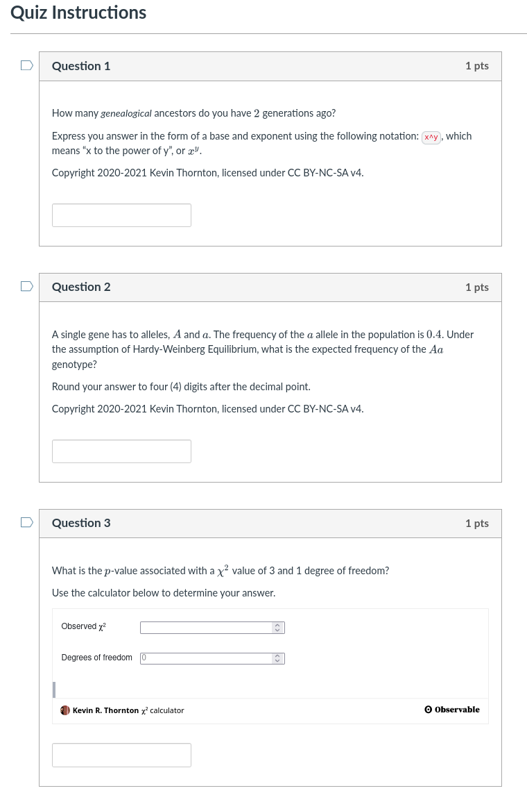

# Example text2qti quiz

## Setup

```sh
bash build_venv.sh
```

```sh
sh venv/bin/activate
```

## Generate the quiz

```sh
PYTHONPATH=. text2qti --run-code-blocks --pandoc-mathml quiz.md
```

Upload the resulting `quiz.zip` to Canvas by whatever means your campus has for that.
Here, we have "sandbox" courses, which are fake Canvas courses.
I upload to those to test-drive everything first.

For me, I see this when I preview the quiz:



## Details

* The `custom_rounding.py` uses tricks from finance to ensure rounding.
  This is necessary because:

  * Computers use IEEfp to round
  * Biology students typically round incorrectly, defaulting
    to "half rounds up" rather than the correct "round to even".
  * The module sets to "half rounds up" rather than trying to teach
    loads of students how to round properly.

* The copyright notice for each question should keep the material off of Chegg, Course Hero, etc.,
  who claim to use image recognition to reject such material.
